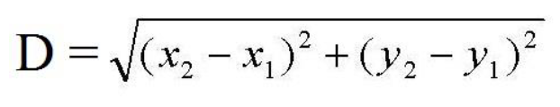

# Lista de Exercícios 1

## Questões

[1. Escreva um algoritmo para ler um valor (do teclado) e escrever (na tela) o seu antecessor.](1.cpp)

[2. Escreva um algoritmo para ler as dimensões de um retângulo (base e altura), calcular e escrever a área do retângulo.](2.cpp)

[3. Ler uma temperatura em graus Celsius e apresentá-la convertida em graus Fahrenheit. A fórmula de conversão é F ← C * 9 / 5 + 32, sendo F a temperatura em Fahrenheit e C a temperatura em Celsius.](3.cpp)

[4. Ler uma temperatura em graus Fahrenheit e apresentá-la convertida em graus Celsius. A fórmula de conversão é C ← ((F – 32) * 5) / 9, sendo F a temperatura em Fahrenheit e C a temperatura em Celsius.](4.cpp)

[5. Elaborar um programa que calcule e apresente o valor do volume de uma caixa retangular, utilizando a fórmula VOLUME ← COMPRIMENTO * LARGURA * ALTURA.](5.cpp)

[6. Elaborar um programa que calcule e apresente o valor do volume de uma caixa retangular, utilizando a fórmula VOLUME ← COMPRIMENTO * LARGURA * ALTURA.](6.cpp)

[7. Efetuar a leitura de um valor numérico inteiro e apresentar o resultado do valor lido elevado ao quadrado, sem efetuar o armazenamento do resultado em memória.](7.cpp)

[8. Faça um algoritmo que leia a idade de uma pessoa expressa em anos, meses e dias e escreva a idade dessa pessoa expressa apenas em dias. Considerar ano com 365 dias e mês com 30 dias.](8.cpp)

[9. Escreva um algoritmo para ler o número total de eleitores de um município, o número de votos brancos, nulos e válidos. Calcular e escrever o percentual que cada um representa em relação ao total de eleitores.](9.cpp)

[10. Escreva um algoritmo para ler o salário mensal atual de um funcionário e o percentual de reajuste. Calcular e escrever o valor do novo salário.](10.cpp)

[11. O custo de um carro novo ao consumidor é a soma do custo de fábrica com a porcentagem do distribuidor e dos impostos (aplicados ao custo de fábrica). Supondo que o percentual do distribuidor seja de 28% e os impostos de 45%, escrever um algoritmo para ler o custo de fábrica de um carro, calcular e escrever o custo final ao consumidor.](11.cpp)

[12. Uma revendedora de carros usados paga a seus funcionários vendedores um salário fixo por mês, mais uma comissão também fixa para cada carro vendido e mais 5% do valor das vendas por ele efetuadas. Escrever um algoritmo que leia o número de carros por ele vendidos, o valor total de suas vendas, o salário fixo e o valor que ele recebe por carro vendido. Calcule e escreva o salário final do vendedor.](12.cpp)

[13. Faça um algoritmo que leia três notas de um aluno, calcule e escreva a média final deste aluno. Considerar que a média é ponderada e que o peso das notas é 2, 3 e 5.](13.cpp)

[14. Faça um algoritmo para calcular a distância entre dois pontos. Entre com o valor de X1, X2, Y1, Y2 ](14.cpp)

[15. Faça um algoritmo que converta graus em radianos. Imprima o valor em radianos e o seu correspondente em graus.](15.cpp)

[16. Elaborar um programa que leia uma medida em pés, calcular, armazenar e apresentar o seu valor convertido em metros, lembrando que um pé mede 0,3048 metro, ou seja, um pé é igual a 30,48 centímetros.](16.cpp)

[17. Elaborar um programa que leia uma medida em pés, calcular, armazenar e apresentar o seu valor convertido em metros, lembrando que um pé mede 0,3048 metro, ou seja, um pé é igual a 30,48 centímetros.](17.cpp)

[18. Construir um programa que leia um valor numérico inteiro e apresente como resultado armazenado em memória os seus valores sucessor e antecessor.](18.cpp)

[19. Construir um programa que calcule, armazene e apresente em metros por segundo o valor da velocidade de um projétil que percorre uma distância em quilômetros a um espaço de tempo em minutos. Utilize a fórmula VELOCIDADE ← (DISTÂNCIA * 1000) / (TEMPO * 60).](19.cpp)

[20. Elaborar um programa que leia dois valores numéricos reais desconhecidos representados pelas variáveis A e B. Calcular, armazenar e apresentar os resultados das quatro operações aritméticas básicas.](20.cpp)